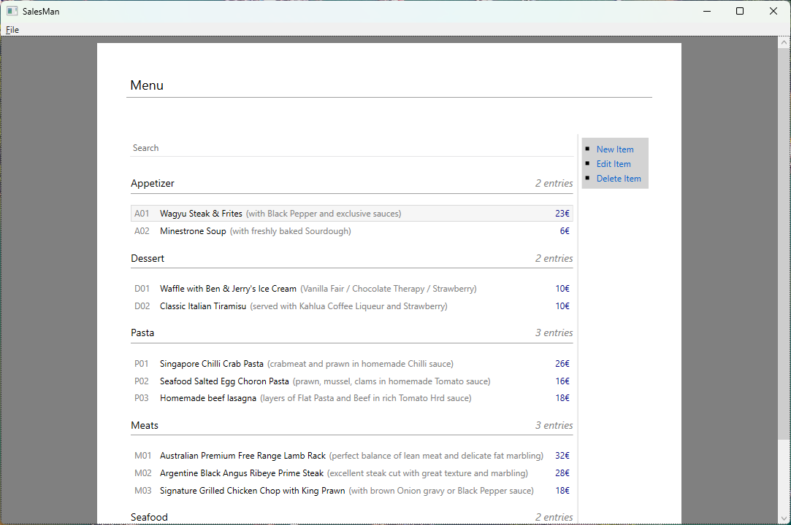

<h1 align="center">
  

  <p align="center">SalesMan - A Simple POS application</p>
</h1>

## Table of Contents

- [Features](#features)
- [Development](#development)
    - [Requirements](#requirements)
    - [Build](#build)
    - [Publish](#publish)
- [Running](#running)
    - [Requirements](#requirements)

## Features

- Manage menu
- Manage customers
- Manage orders
- Print order receipt

## Development

### Requirements

- .NET Framework 4.8.1
- Build Tools for Visual Studio 2019+ (for building)

### Build

```shell
./compile.bat
```

### Publish

```shell
./publish.bat
```

## Running

### Requirements

- .NET Framework 4.8.1
- SumatraPDF (for printing support, put the executable in `native` folder)
